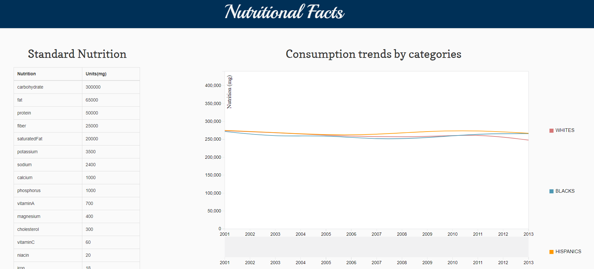
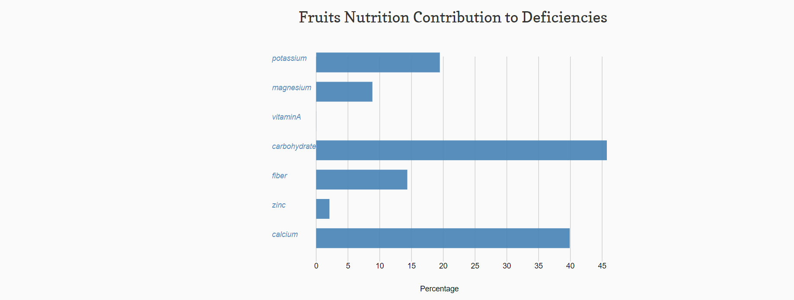

# Nutritional Facts
<p> <a href="http://www.cs.odu.edu/~gkathire/Viz_9/">>Web page Link</a></p>
<p>
Daily nutrition is a definite measure for everyone to compare the levels of nutrition intake. Amidst comparison to
the daily standard values, there are certain nutrients which become deficient based on the food intake. Taking this into consideration,
we developed a web-based visualization which is likely to show the standards and intake measures over the years by considering three
different races. Substantially, we also show the key differences in the intake levels of various nutritions and the deficiencies as well.
Having analyzed and identified the understanding of deficient nutrition, it is quite important to overcome the deficiency. Thus, we also
present sufficient information visually where proper nutrition can be formulated through consumption of fruits. The purpose of this
project to understand the Grey areas of nutrition standards and deficiencies. Also, derive a definite way to fill the nutritional gap.
</p>

## Technologies
```
D3.js, NVD3, jQuery, JavaScript
```

<p>Supports Desktop View</p>

### Few images which demonstrates the website visual impression  can be observed below.
<br>
<br>

## Image 


## Image 


